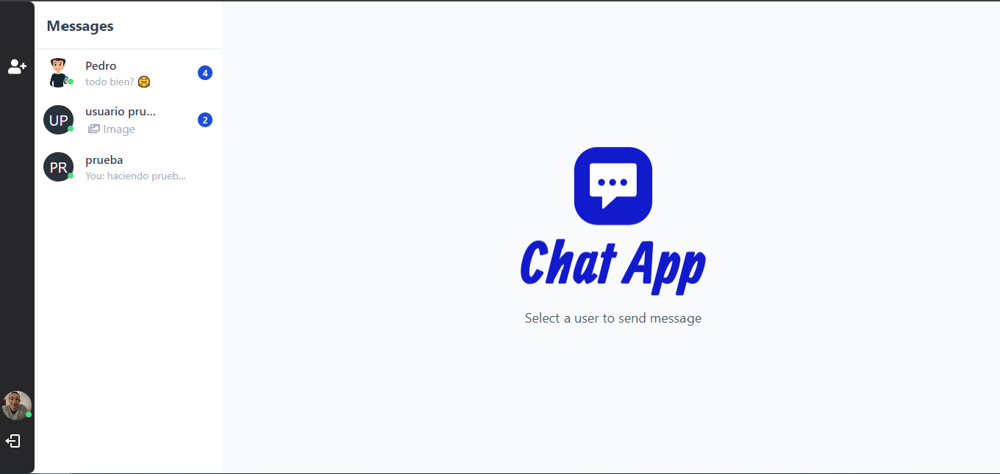
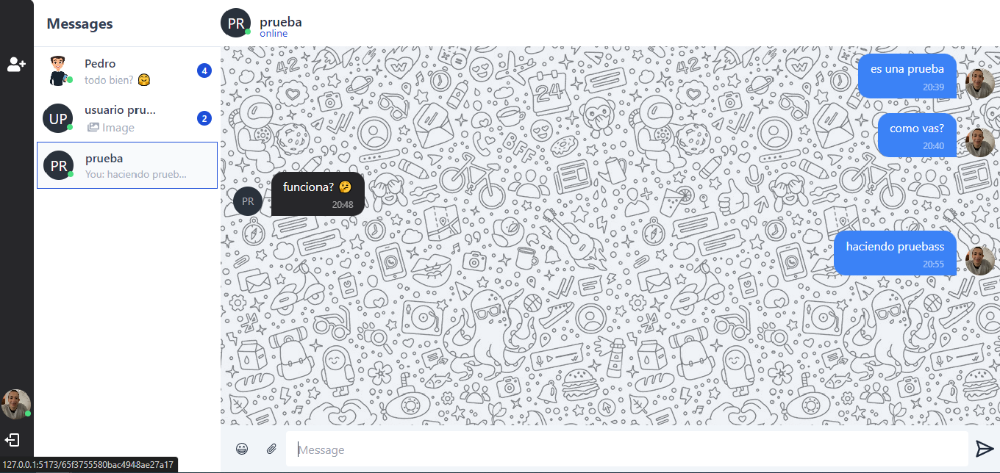
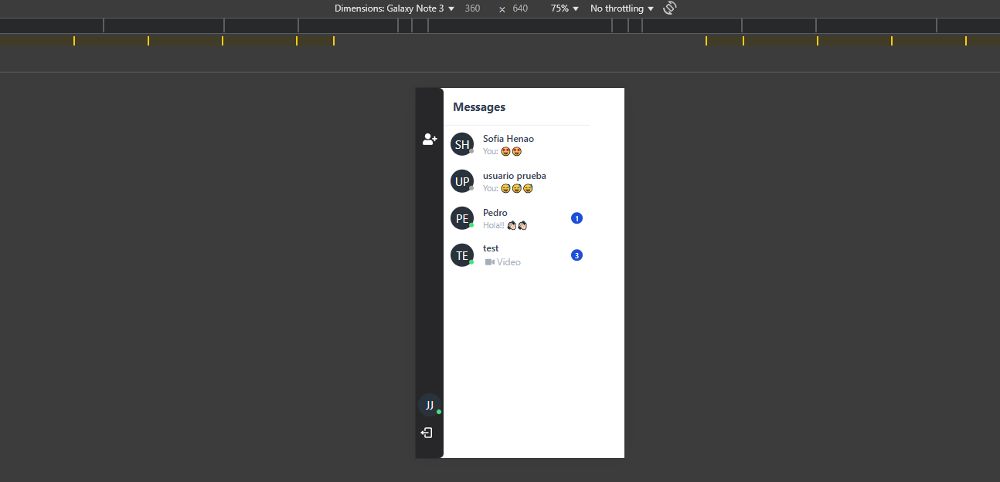
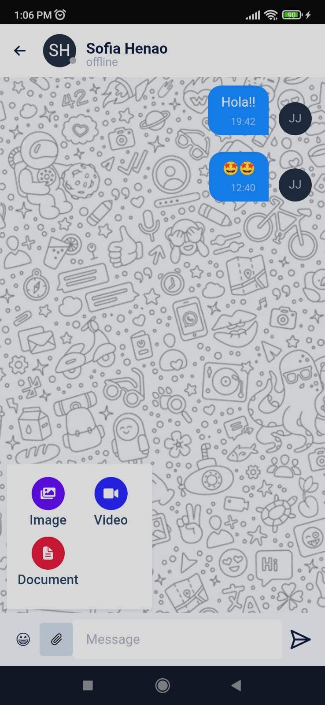

# Chat en Tiempo Real

Este proyecto personal es un chat en tiempo real que desarrollé con Node.js, Express, MongoDB, Cloudinary y Socket.IO en el backend, y con React, Tailwind CSS y Axios en el frontend.






## Características
- Mensajería en tiempo real con WebSockets.
- Soporte para imágenes, videos y documentos mediante Cloudinary.
- Interfaz moderna y responsiva con Tailwind CSS.
- Manejo de autenticación con JWT y protección de rutas.
- Persistencia de datos con MongoDB.
- API RESTful para la gestión de usuarios y chats.
- Contador de mensajes no leídos.
- Soporte para emojis en los mensajes.

## Tecnologías Utilizadas

### Backend:
- Node.js
- Express.js
- MongoDB con Mongoose
- Cloudinary para almacenamiento de archivos
- Socket.IO para comunicación en tiempo real
- JSON Web Token (JWT) para autenticación

### Frontend:
- React.js
- Tailwind CSS
- Axios para peticiones HTTP

## Despliegue
El proyecto está desplegado en **Render** y puedes acceder a la aplicación en el siguiente enlace:
https://chat-app-7cjy.onrender.com/

> ⚠ **Nota:** La aplicación puede tardar unos segundos en abrir si no se ha utilizado recientemente, ya que Render desactiva la instancia cuando no está en uso.

## Instalación y Configuración para desarrollo

### Requisitos previos
- Node.js, npm y pnpm instalados
- MongoDB en ejecución

### Instalación y Construcción del Proyecto
```bash
# Clonar el repositorio
git clone https://github.com/JorgeJ97/chat-app.git
cd chat-app

# Instalar dependencias y construir el proyecto
npm run build
```

### Configuración del proyecto en entorno de desarrollo
Crea un archivo `.env` en la raíz del backend y agrega las siguientes variables:
```env
PORT=3000
MONGO_DB_URL=your_mongodb_connection_string
NODE_ENVIRONMENT = develop
CLOUD_NAME=your_cloud_name
CLOUD_API_KEY=your_api_key
CLOUD_API_SECRET=your_api_secret
JWT_SECRET=your_jwt_secret
```

### Ejecución del servidor en desarrollo
```bash
npm run start
```

El servidor se ejecutará en `http://localhost:3000` por defecto.

## Uso
- Regístrate e inicia sesión.
- Envía y recibe mensajes en tiempo real.
- Comparte imágenes, videos y documentos.
- Utiliza emojis en tus conversaciones.
- Ve el contador de mensajes no leídos.

